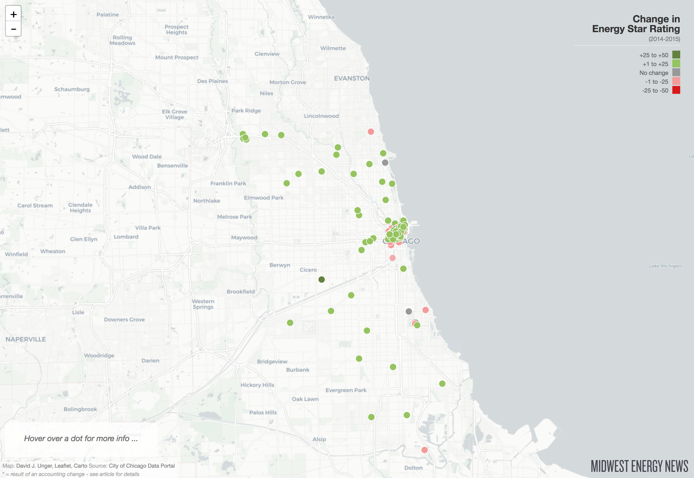
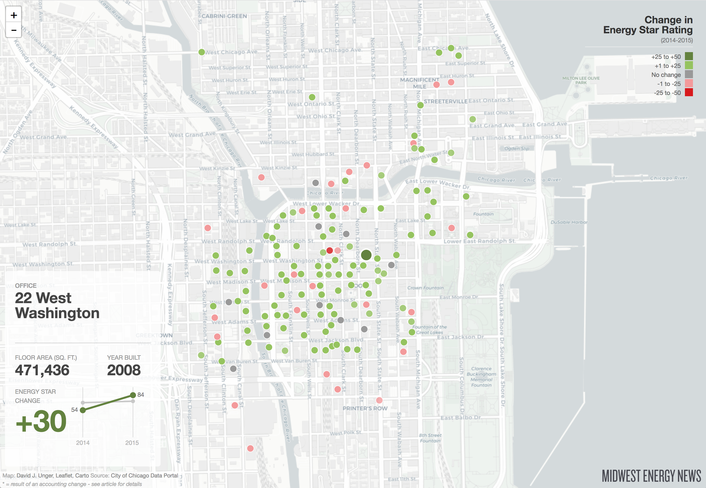

Are Chicago's largest buildings getting more efficient? To find out, I used city data to map which of Chicago's biggest properties have improved their energy performance as measured by the U.S. Environmental Protection Agency’s Energy Star program.

  