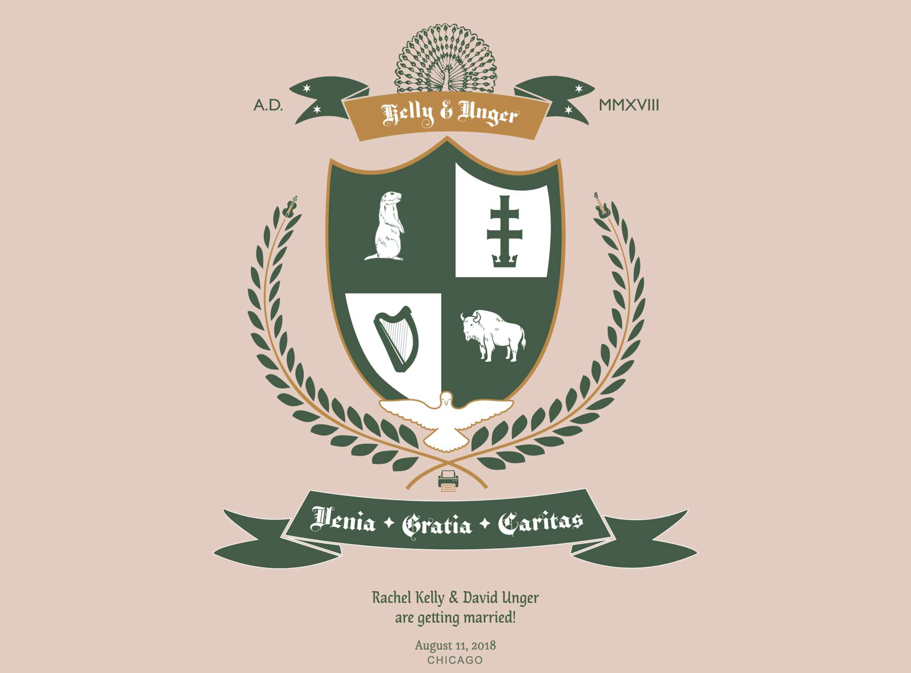
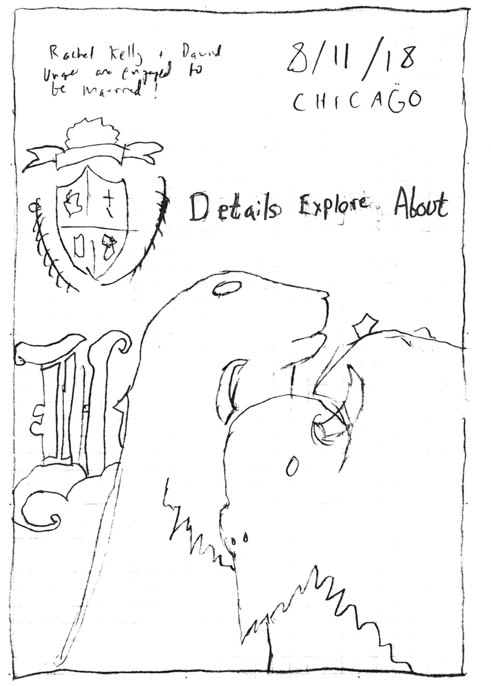
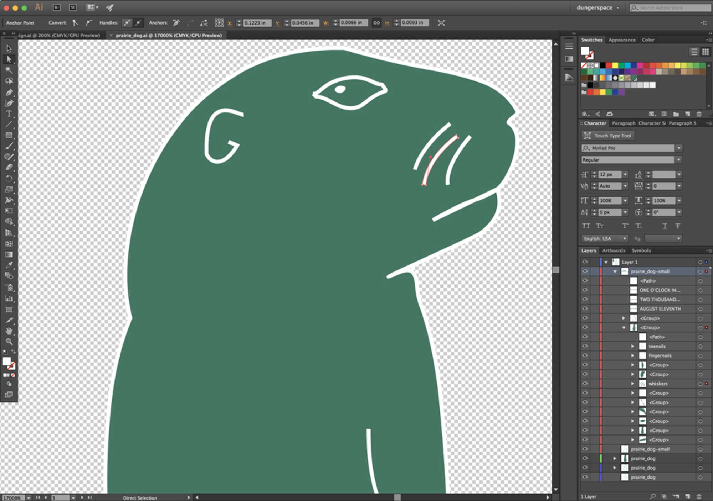
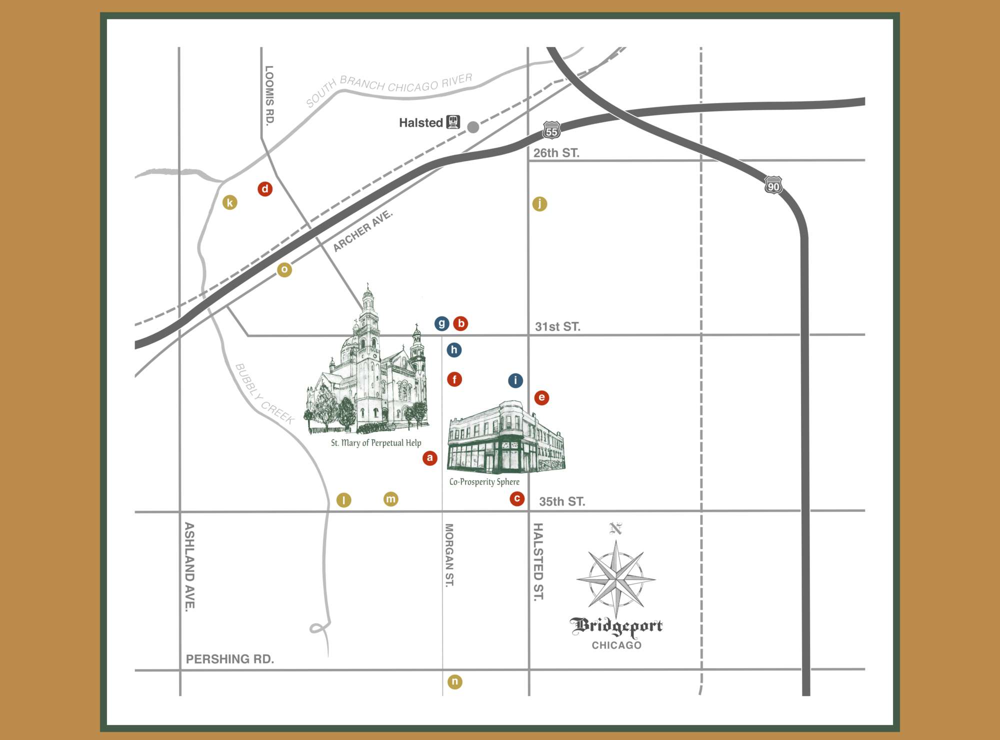
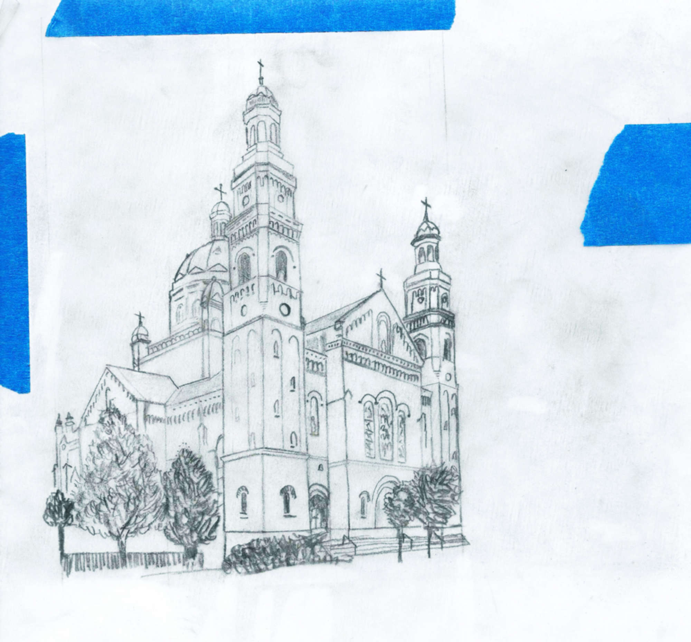
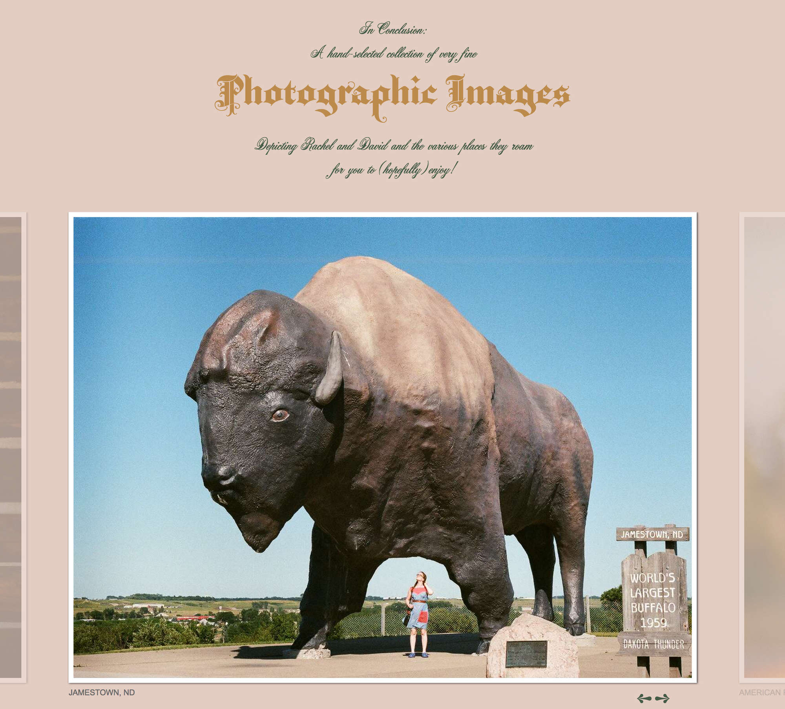

I built a handmade wedding website with help from my now-wife Rachel. We had a lot of fun imagining our own family crest, mapping out our favorite neighborhood spots, and sharing our story with friends and family! 

  

