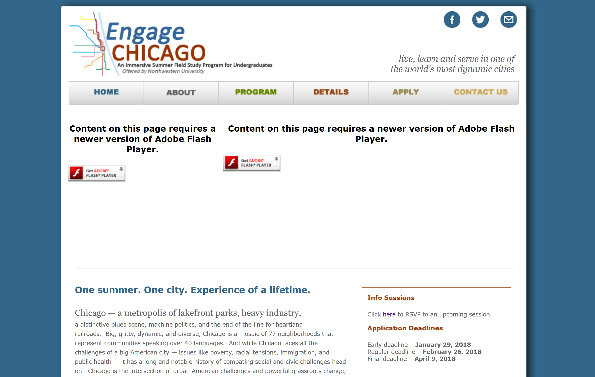
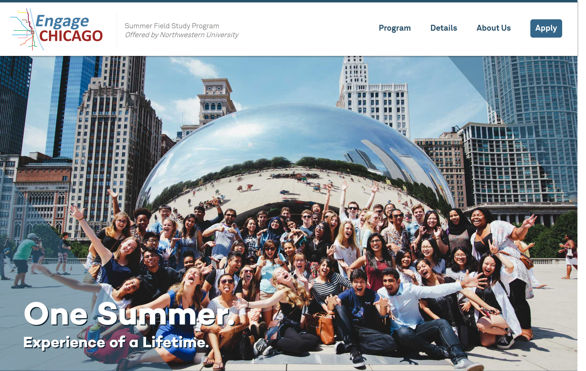
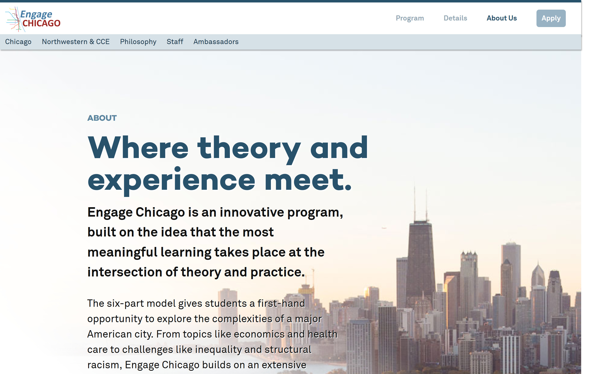
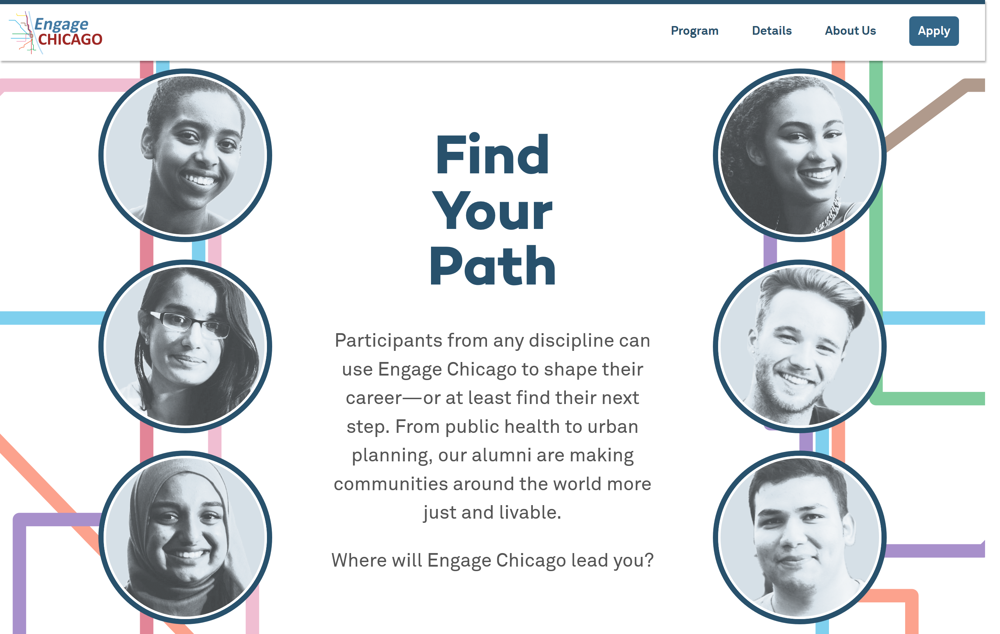
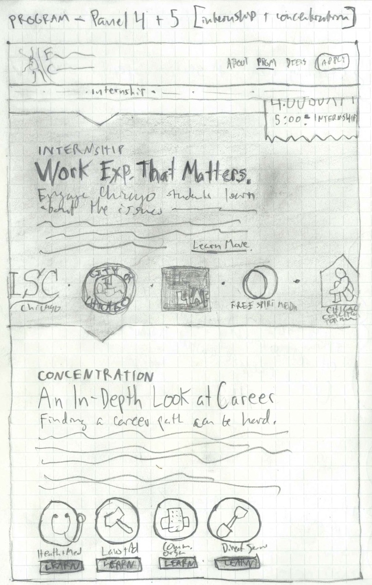
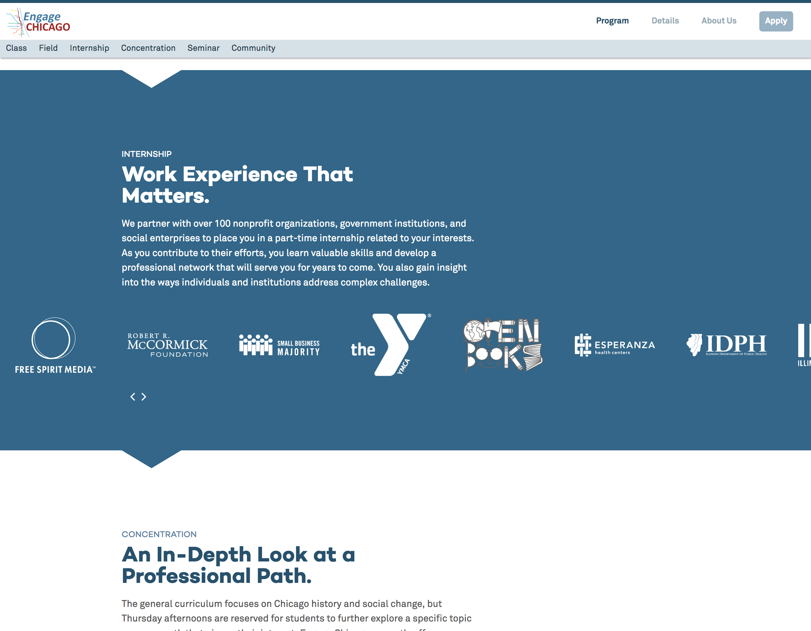

The old website for Northwestern University's summer field-study program was outdated, unresponsive, and lacked any kind of functional content management system. Over the course of a year, I worked with Engage Chicago staff to rewrite, re-organize, and redesign the entire site. The result is a clean, modern, and responsive Wordpress website with custom front- and back-ends. 

<small><em>before:</em></small>

<small><em>after:</em></small>

