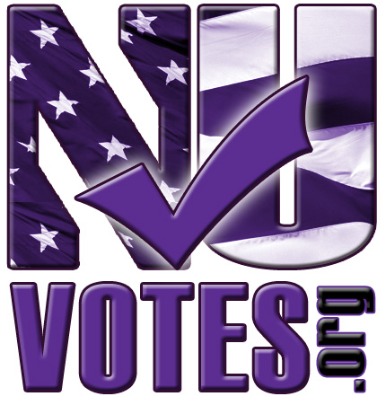
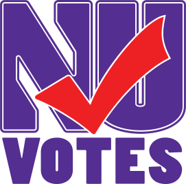
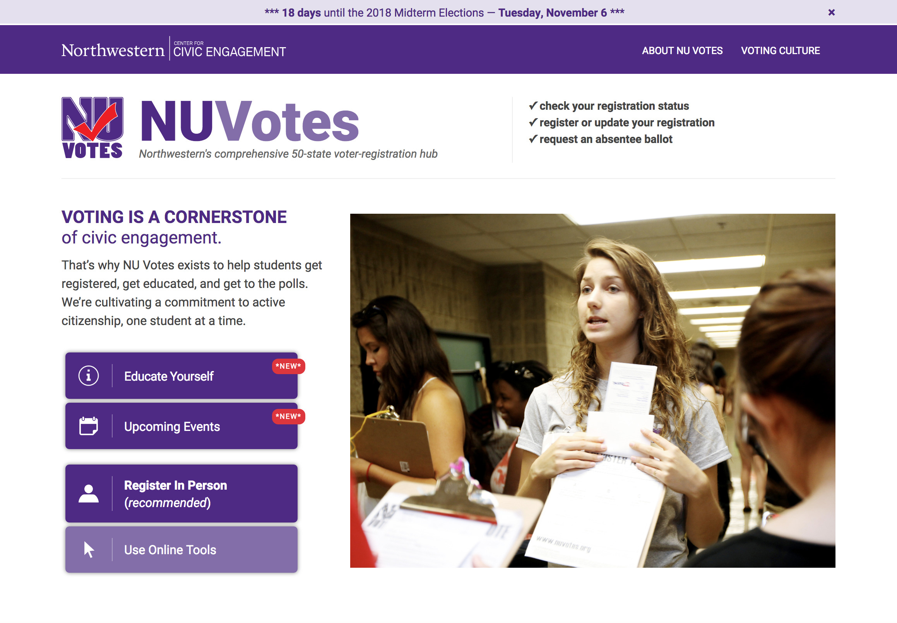
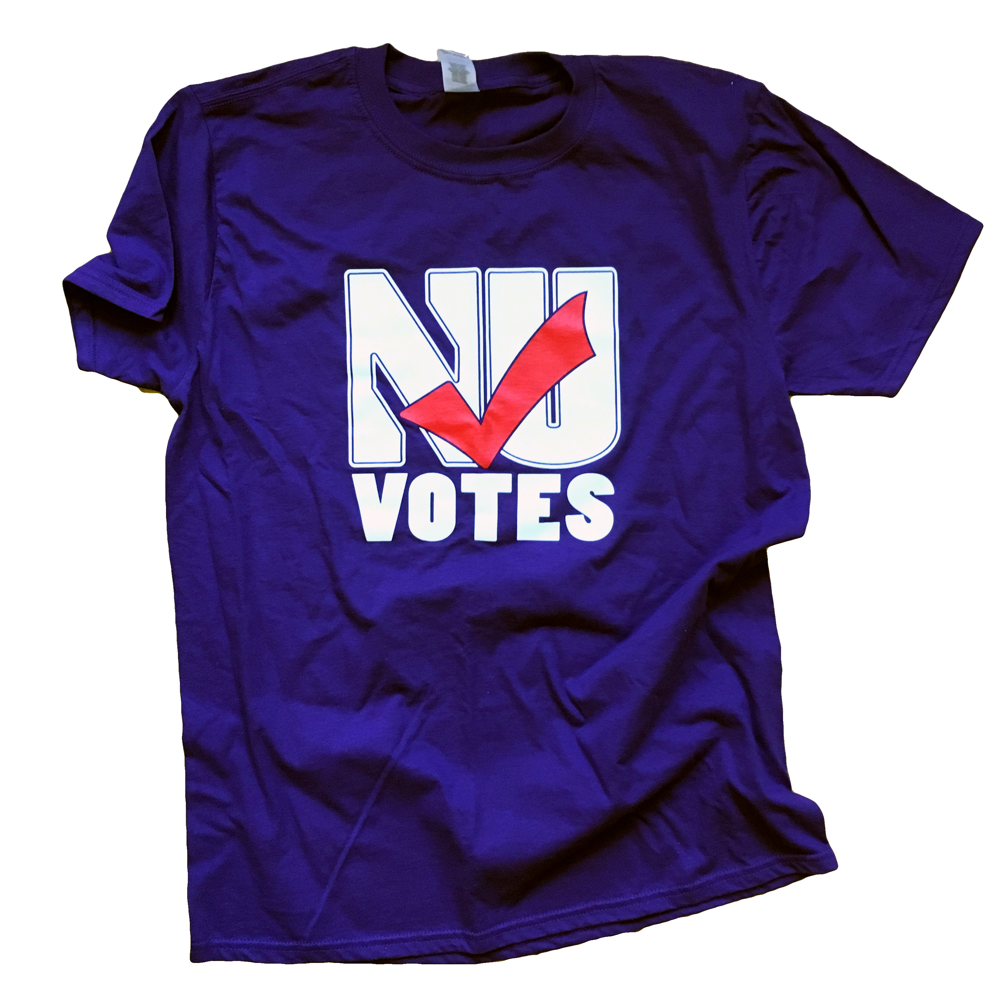
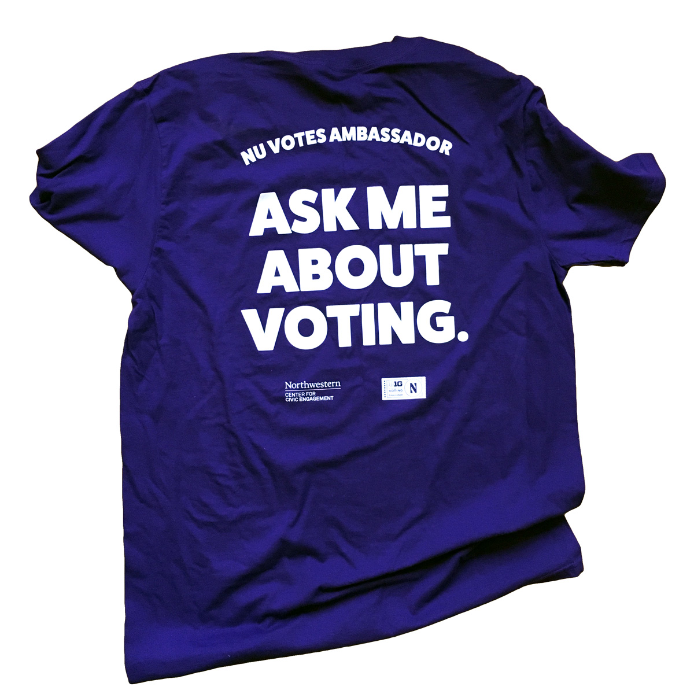
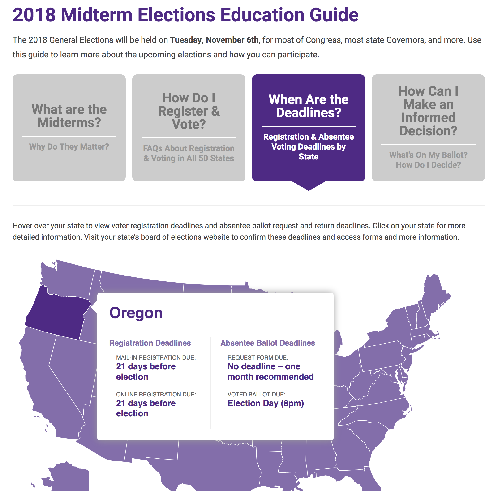
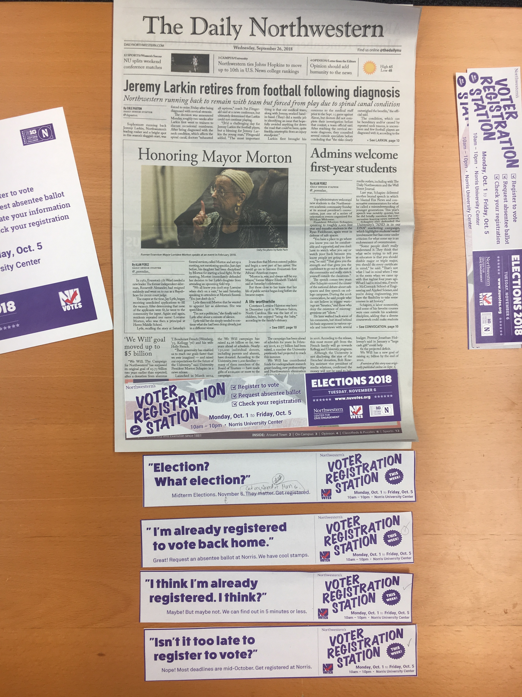
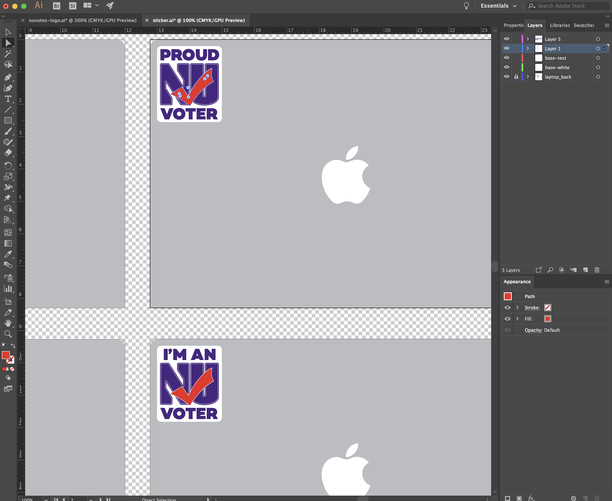
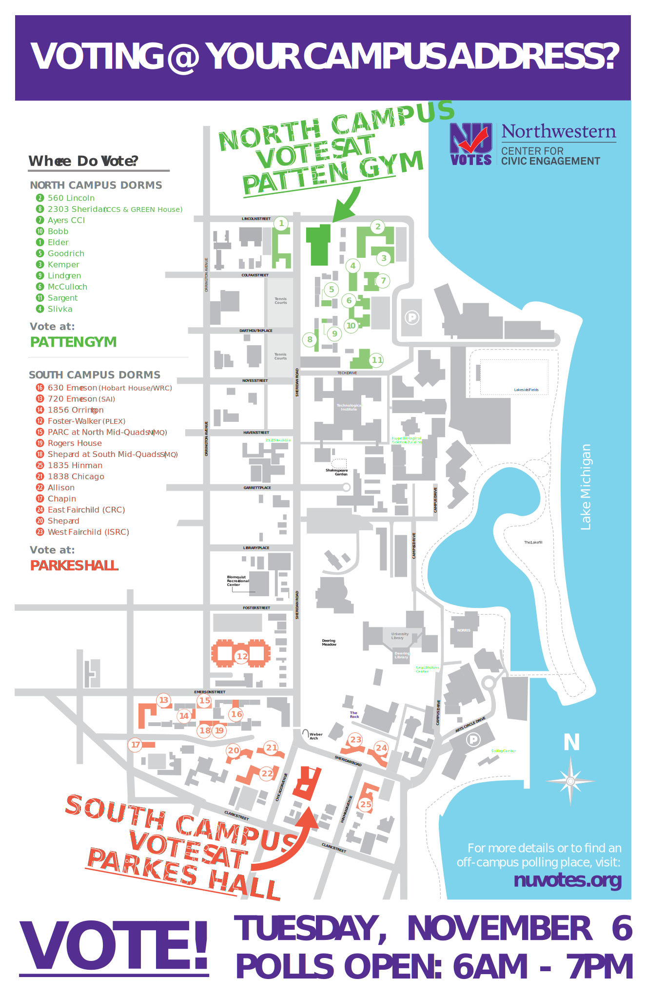
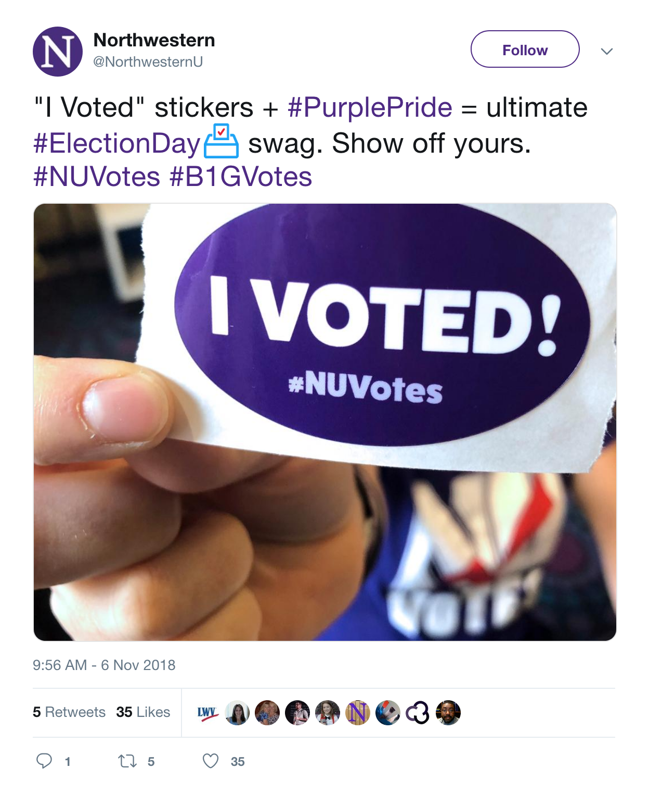

[NUVotes](http://www.nuvotes.org/){:target="_blank"} is a non-partisan initiative designed to provide the Northwestern community with accessible and understandable information about voting. I gave the program's logo a modern update, designed a range of print and web ads to boost registration, and custom-built a website and online education guide.

The efforts have helped the university grow its voting rate to [64 percent](http://www.nuvotes.org/voting-at-northwestern/){:target="_blank"}, which is 14 points higher than the national average for colleges and universities. After the 2016 election, Northwestern was recognized by the [ALL IN Democracy Challenge](https://www.allinchallenge.org/){:target="_blank"} with [five awards](https://news.northwestern.edu/stories/2017/october/innovative-student-voter-model-earns-national-recognition/){:target="_blank"} including Highest Voting Rate Among Large Private 4-Year Institutions and Most Improved Voting Rate Among All Institutions.

<small><em>before:</em></small>  
  

<small><em>after:</em></small>
  

 

 

