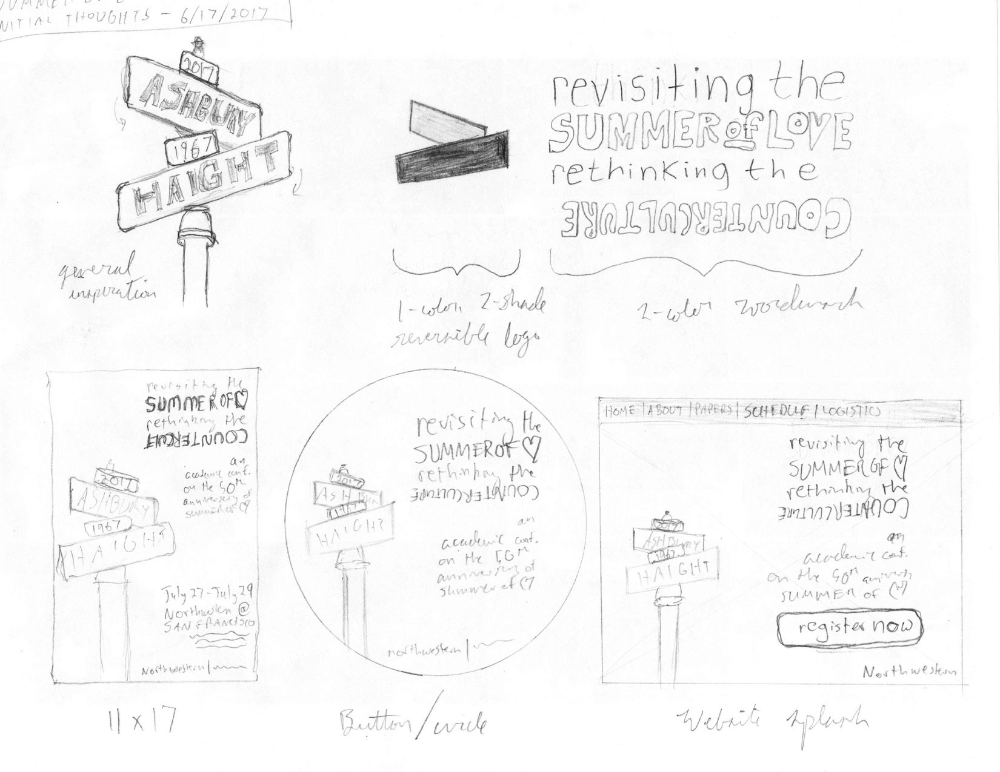
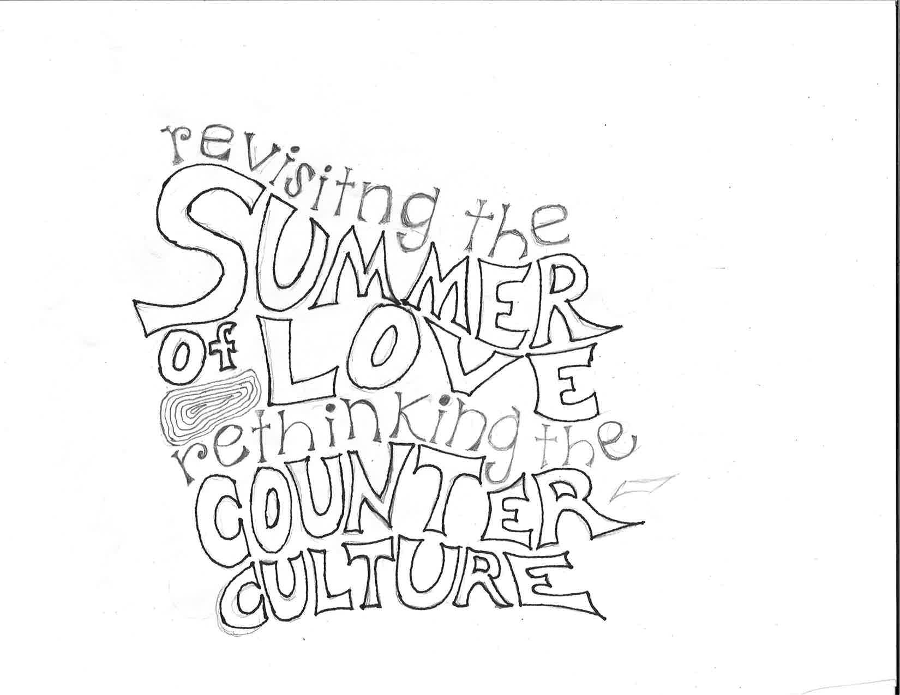
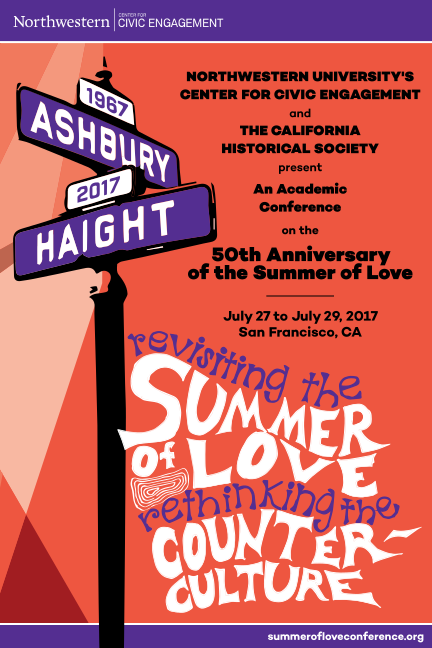
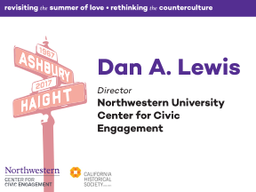

In recognition of the 50th anniversary of the Summer of Love in San Francisco, Northwestern University's Center for Civic Engagement partnered with the California Historical Society to host an interdisciplinary academic conference reexamining that cultural landmark. I developed a hand-drawn wordmark and print collateral that merged Northwestern's global marketing standards with a more vintage, 1960s feel.

