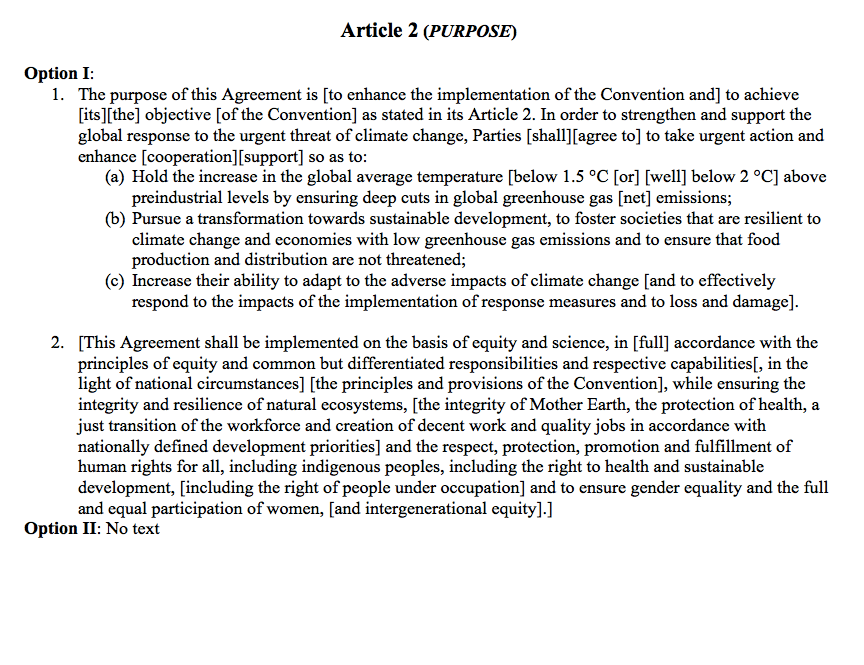

In December of 2015, I traveled to Paris to cover the UN climate talks for [The Christian Science Monitor](http://www.csmonitor.com){:target="_blank"}. I wanted to make a bit of a splash for such a momentous occasion, so I put together a standalone microsite built on the [Atavist](http://www.atavist.com){:target="_blank"} platform. It featured a blog, an interactive map, aggregated CSM stories from Paris and beyond, and a dedicated MailChimp email list. Before I jumped across the Atlantic, [Harvard's NiemanLab interviewed me about the project](http://www.niemanlab.org/2015/11/the-christian-science-monitor-built-a-separate-site-just-for-coverage-of-the-paris-climate-talks/){:target="_blank"}. 

>*I wanted to be able to package various stories in various ways that let them feel and look different from all the regular coverage you might see.*

 

 

 

